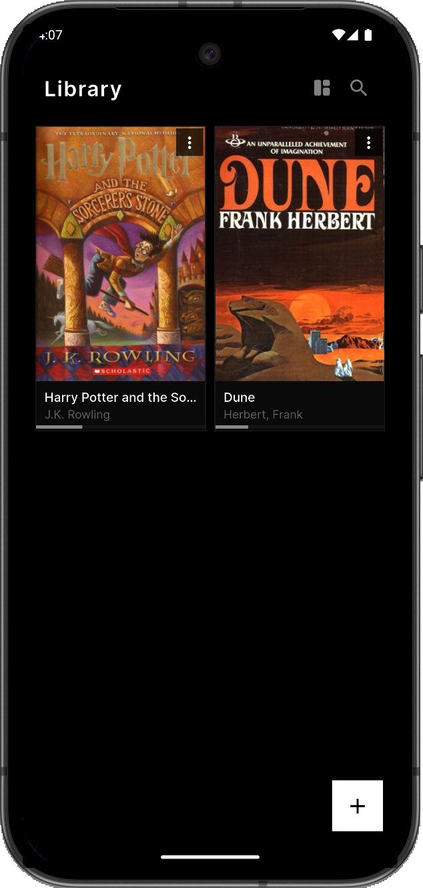
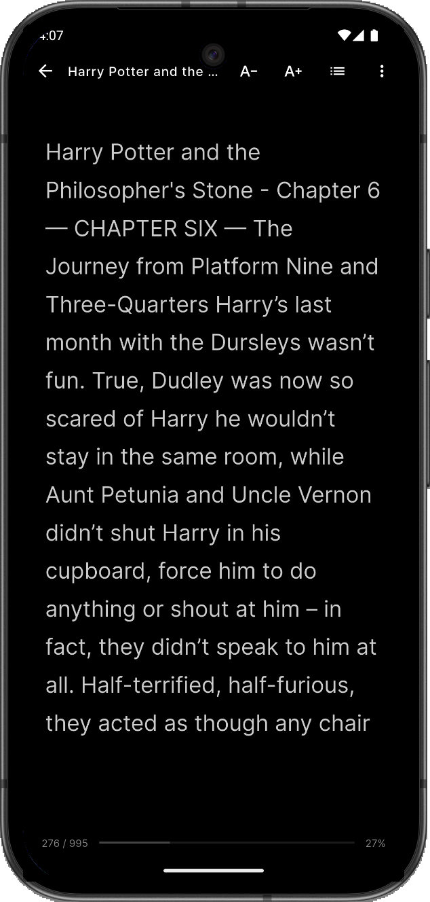
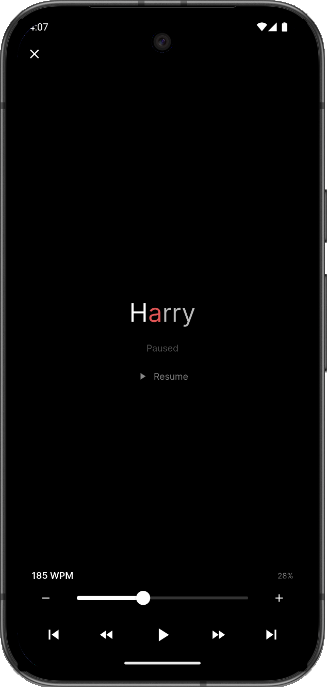

# Ember

An e-book reader with RSVP speed reading, built for Android.

<div align="center">


https://github.com/user-attachments/assets/33003ee7-9d86-4828-b855-1abd1d66d0c3


</div>

## What it does

| Library | Reader | RSVP |
|---|---|---|
|  |  |  |

**Library** — import EPUBs. Grid view with pinch-to-zoom, search, custom covers, progress tracking, sorted by recently read.

**Reader** — page-based swiping, configurable fonts, dark/light mode, double-tap dictionary, table of contents.

**RSVP** — word-by-word speed reading at 50–400 WPM with ORP focal letter highlighting, per-word timing, and breath pauses.

## Build

```
flutter pub get
flutter build apk --release
```

## License

GNU GPL v3
